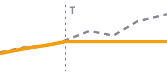
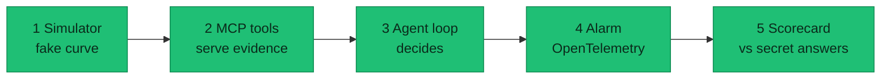

# Mispricing Watch

### Is this published price real, or is our pricing system wrong?

A C# agent built as an MCP server (tool producer) plus a hand-written agent loop (tool orchestrator). Companion to [claude-mcp-flaky-test-agent](https://github.com/bleunguts/claude-mcp-flaky-test-agent), applied to yield-curve pricing. Built as an incremental tutorial: concept first, then code, one small session at a time.

---

## 🟥 The problem

> [!CAUTION]
> A wrong rate goes public fast. Win condition: **few alarms, almost all real.**

- The bank publishes rates. They flow straight to the public and to Bloomberg.
- A price far from where it was an hour ago can still be right. Markets move.
- The agent raises an alarm when the **pricing system itself** looks broken. A human then checks.

## 🟦 Where a price travels

> [!NOTE]
> We can see the start and the end. We cannot see values between the hops.

.NET and quant-library upgrades underneath can also move prices.

| Comparison | Question it answers | Used in |
|---|---|---|
| published vs benchmark | Is the price off the market? | **MVP** |
| published vs wire | Did our side break it? | after MVP |
| wire vs benchmark | Is the source itself wrong? | after MVP |

## 🟪 How the agent decides

> [!IMPORTANT]
> Five rules, no magic number.

| Rule | What it means |
|---|---|
| **Judge the gap** | Compare the price with a benchmark. Market moves hit both, so they cancel out. |
| **Own normal per node** | Each tenor learns its normal from its own history, 1 month up to 1 year. The 10Y and 50Y get different tolerances. |
| **Must persist** | One odd tick is ignored. The gap has to hold. |
| **One cause, one alarm** | Ten nodes broken by the same thing is a single alarm. |
| **Budget first** | Pick how many false alarms you can live with, then derive the tolerance. |

## 🟨 What faults look like

> [!WARNING]
> Faults have shapes. Market moves do not. Orange is the published price, dashed grey is the benchmark.

<table>
  <tr>
    <td align="center"></td>
    <td align="center"></td>
    <td align="center"></td>
    <td align="center"></td>
  </tr>
  <tr>
    <td align="center"><b>Real market move</b> Both move together. Gap stays flat. ✅ no alarm</td>
    <td align="center"><b>A setting changed</b> A step, then a permanent offset. 🚨 alarm</td>
    <td align="center"><b>Stale price</b> Published freezes, benchmark moves. 🚨 alarm</td>
    <td align="center"><b>Unit or scaling error</b> The gap is a clean power of ten. 🚨 alarm</td>
  </tr>
</table>

Also in the long-term plan: a node that tracks the wrong neighbour, and a bug where futures meet swaps.

## 🟧 The alarm budget

> [!TIP]
> Too many false alarms and nobody looks. Targets will evolve.

<table>
  <tr>
    <td align="center"><h2>52</h2>nodes 13 tenors × about 4 curves</td>
    <td align="center"><h2>~156</h2>false alarms per pass if each check cries wolf 3 times. Unusable.</td>
    <td align="center"><h2>≤ 20%</h2>of alarms false to limit manual checking</td>
    <td align="center"><h2>≤ 5%</h2>of real faults missed 10% is the hard limit</td>
  </tr>
</table>

A miss is catastrophic for the engineer responsible, but traders usually catch it, so it must be rare.

## 🟩 The MVP

> [!TIP]
> A fake world, planted faults, one question: **alarm or no alarm?**

| Fake world | Four tools | Pass mark | Left out on purpose |
|---|---|---|---|
| One small curve, about a month of history | `get_history` | At least 80% of alarms are real | Change log tool |
| A benchmark series | `get_benchmark` | At most 5% of faults missed | Wire price |
| Planted faults: stale, unit error, setting change | `compute_spread_stats` | Beats a plain fixed-threshold rule | Cause labels |
| Real market moves that must stay quiet | `check_stale` | | Futures and swaps seam, several curves, web benchmarks, Excel report |

The ground-truth labels never reach the agent. The alarm is emitted as an OpenTelemetry record; a local viewer (Grafana or the .NET Aspire dashboard) is chosen later.

## 🩷 Roadmap

| Phase | What | Status |
|---|---|---|
| **0** | **Requirements.** Sign off the MVP. | 👈 **you are here** |
| 1 | Simulator: fake curve, planted faults, hidden answers. Tests added. | MVP |
| 2 | MCP tools, tried in MCP Inspector. | MVP |
| 3 | Agent loop and scoring. Needs API credits. | MVP |
| 4 | Calibration: per-node tolerance from history, alarm budget. | later |
| 5 | Futures and swaps: one unit, and the seam between them. | later |
| 6 | Shape and onset: butterflies, change points, release log, wire price. | later |
| 7 | Polish: confidence scores, optional web benchmark, report. | later |

## ❓ Open decisions

- [ ] Which nodes the MVP curve uses (placeholder: 2Y, 5Y, 10Y against a government benchmark, plus one long node against a noisier competitor rate)
- [ ] Confirm the error targets: under 20% of alarms false, at most 5% of real faults missed
- [ ] Confirm the MVP outputs alarm or no alarm only, with no cause label
- [ ] Confirm wire price waits until after the MVP

## 📚 Docs

| File | What is in it |
|---|---|
| [`ROADMAP.md`](./ROADMAP.md) | Problem framing, design principles, MVP scope, phases, open questions. Includes the original proposal. |
| [`docs/REQUIREMENTS.md`](./docs/REQUIREMENTS.md) | Requirements answers and the MVP versions (v1 to v3). |
| [`CLAUDE.md`](./CLAUDE.md) | Working rules and session log. |

Source layout: `src/MispricingWatch.CurveLab` (simulator library), `src/MispricingWatch.McpServer` (tool producer), `src/MispricingWatch.Agent` (tool orchestrator). All currently empty stubs with TODO comments.
